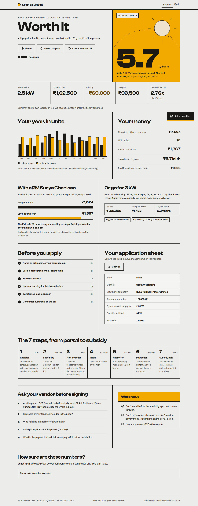
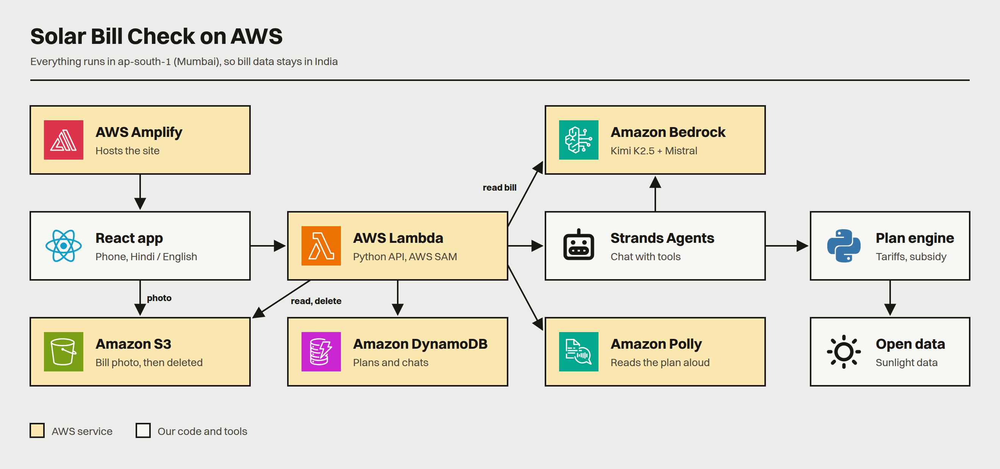

# Solar Bill Check

**One photo of your electricity bill. One honest answer on rooftop solar.**

Live app: **https://main.d2y09rdd9synq1.amplifyapp.com** · Demo video: VIDEO_LINK

Take a photo of your electricity bill. In about 10 seconds the app tells you whether rooftop solar is worth it for your home: the right system size, the PM Surya Ghar subsidy, what you actually pay, when it pays back, the loan EMI next to your monthly saving, and how to apply without getting rejected. It reads bills in any Indian language, works in English and Hindi, and has a chat assistant that answers in Hindi, English or Hinglish using your own numbers.

Built for [Environmental Hacks](https://www.wemakedevs.org/aws/env) (WeMakeDevs × AWS Builder Center, Oct 8–11 2026), Waste and Energy track.



## How it works



| Part | AWS service |
|---|---|
| Bill reading: two models read every bill in parallel; disagreements go to the user | Amazon Bedrock (Kimi K2.5 + Mistral Large 3) |
| API: upload, extract, plan, saved plans, speech, chat | AWS Lambda (Python 3.14, arm64) with Function URLs, deployed with AWS SAM |
| Bill uploads, deleted right after reading | Amazon S3 |
| Shareable plans and chat history | Amazon DynamoDB |
| Chat assistant with tools over the user's plan | Strands Agents SDK on Bedrock |
| Read the plan aloud in Hindi or English | Amazon Polly |
| Website | AWS Amplify Hosting |

Everything runs in ap-south-1 (Mumbai), so bill data stays in India.

## Repo

| Folder | What's in it |
|---|---|
| [`frontend/`](frontend) | React 19 + Vite 8 app, English and Hindi, Playwright end-to-end test |
| [`backend/`](backend) | SAM template, Lambda API, plan engine (tariffs, subsidy, sizing, payback, readiness), 142 tests |
| [`eval/`](eval) | 24 test bills in 9 languages and the benchmark that picked the Bedrock models (18 models tested) |
| [`docs/`](docs) | [Writeup](docs/WRITEUP.md), [scope and edge cases](docs/SCOPE.md), [research and sources](docs/RESEARCH.md), [stack](docs/STACK.md), [build plan](docs/PLAN.md), [hackathon rules](docs/HACKATHON.md) |
| [`design-options/`](design-options) | The three design directions we explored before building |

## Run it

```sh
# backend (needs AWS credentials, SAM CLI and Python 3.14)
cd backend && uv run pytest && sam build && sam deploy

# frontend
cd frontend && npm ci && npm run dev
scripts/deploy-frontend.sh   # build and publish to Amplify
```

## AI tools used

- Claude Code: planning, research, code, tests and docs.
- Amazon Bedrock models inside the product, as listed above.
